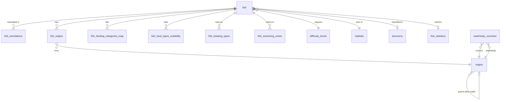

# 🐟 Fischlexi – Datenbankarchitektur-Review

> **Projekt:** FischlexiDB (Supabase, PostgreSQL 17)  
> **Projekt-ID:** `frbxqebitypohwopipwq`  
> **Region:** `eu-central-1`  
> **Status:** Post-Migration Schema (Internationalisierung & RLS-Härtung abgeschlossen)

---

## 1. Schema-Überblick (Post-Migration)

### 1.1 Relationen-Architektur (17 Tabellen + Views)
Das Schema ist vollständig normalisiert und trennt sprachunabhängige Fisch-Eigenschaften von sprachspezifischen Übersetzungen:

### 1.2 Kerntabellen

#### `fish` (Basisdaten)
| Spalte | Typ | Besonderheit |
|--------|-----|-------------|
| `id` | `bigint` (identity) | PK |
| `latin_name` | `text` | Wissenschaftlicher Name |
| `image_url_main` / `image_gallery_urls` | `text` / `text[]` | Bild-Ressourcen |
| `size_cm_min/max` | `numeric` | Größenbereich in cm |
| `lifespan_years_min/max` | `integer` | Lebenserwartung |
| `water_temperature_min/max_c` | `numeric` | Temperaturbereich |
| `water_ph_min/max` | `numeric` | pH-Bereich |
| `water_hardness_dh_min/max` | `numeric` | Wasserhärte (°dH) |
| `aquarium_min_liters` / `aquarium_min_edge_length_cm` | `integer` | Beckenanforderungen |
| `primary_habitat_id` / `difficulty_level_id` | `bigint` | FKs zu Lookup-Tabellen |
| `taxonomy_id` | `bigint` | FK zu biologischer Taxonomie |
| `is_published` | `boolean` | Veröffentlichungs-Flag (strikt RLS-geschützt) |
| `author_notes` | `text` | Interne Redaktionsnotizen (`REVOKE SELECT` für anon) |

#### `fish_translations` (Internationalisierte Inhalte)
| Spalte | Typ | Besonderheit |
|--------|-----|-------------|
| `id` | `bigint` (identity) | PK |
| `fish_id` | `bigint` | FK → fish.id (ON DELETE CASCADE) |
| `language_code` | `varchar(2)` | z.B. 'de', 'en' |
| `name` | `varchar(255)` | Lokalisierter Name (z.B. "Guppy", "Skalar") |
| `slug` | `varchar(255)` | Eindeutiger Slug pro Sprache (`UNIQUE(language_code, slug)`) |
| `common_other_names` | `text[]` | Synonyme |
| `description_*` (5 Spalten) | `text` | Ausführliche Beschreibungen |
| `search_vector` | `tsvector` | GIN-Indexierter Volltext-Vektor |

---

## 2. Row Level Security (RLS) & Zugriffskontrolle

> [!IMPORTANT]
> **RLS ist für alle Tabellen aktiviert und gehärtet.**
> Öffentlicher Datenverkehr (`anon`) nutzt ausschließlich `getSupabasePublic()` und kann unvollständige Entwürfe (`is_published = false`) oder interne Notizen (`author_notes`) zu keinem Zeitpunkt abfragen.

### Aktive RLS-Policies:
1. **`fish` (Tabelle):**
   - `anon`: `SELECT` nur wenn `is_published = true`.
   - `authenticated`: `SELECT` auf alle Datensätze.
   - `author_notes`: Spaltenprivileg für `anon` entzogen (`REVOKE SELECT`).
2. **`fish_translations` (Tabelle):**
   - `anon`: `SELECT` nur wenn der verknüpfte Fisch `is_published = true` besitzt (`EXISTS (SELECT 1 FROM fish WHERE fish.id = fish_translations.fish_id AND fish.is_published)`).
3. **`fish_statistics` (Tabelle):**
   - `public`: Leserecht, aber Schreibzugriffe nur via Server-Prozesse.

---

## 3. Indizierung & Performance

- **Volltextsuche:** `fish_translations_search_idx` (GIN) über `search_vector`.
- **Hierarchische Herkunft (`origins`):** `ltree`-Extension installiert; Pfad-Spalte `path` für hierarchische Gewässer-Abfragen.
- **RLS-Beschleunigung:** Partial Index `idx_fish_published_true` auf `fish(id) WHERE is_published = true`.
- **Materialized Views:** `origin_fish_counts` aggregiert publizierte Fischzahlen pro Region.
